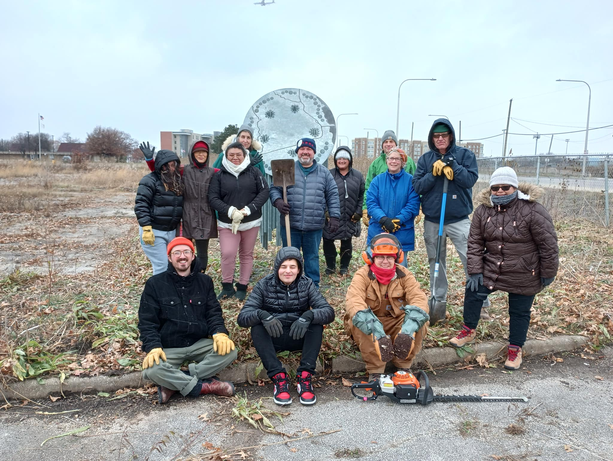
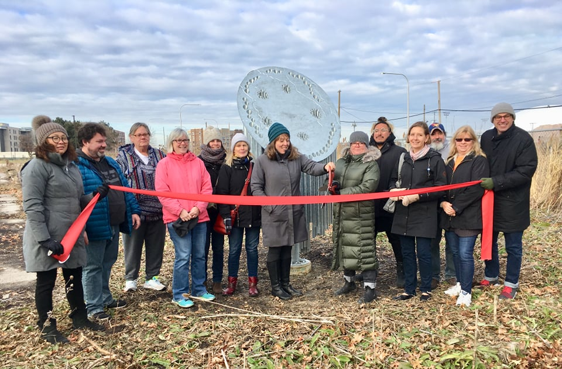

+++
title = 'Who we are'
Description = 'The Dunning Read Natural Area Park Advisory Council is a volunteer group of passionate community members'
date = 2023-01-01T08:00:00-07:00
draft = false
+++

{class="p-5 w-full"}

## Our Mission   ## { class="p-1 text-center text-xl sm:text-2xl lg:text-4xl" }

The Dunning Read Natural Area Park Advisory Council (PAC) is volunteer group of passionate community members. The group's mission is to support the Chicago Park District in restoring and preserving this natural area to provide a quality habitat for diverse native plants and wildlife as well as opportunities for access, education, and recreation for the entire community.

## Our Board   ## { class="p-1 text-center text-xl sm:text-2xl lg:text-4xl" }



The Dunning Read Natural Area Park Advisory Council meets monthly at the [Dunning Library](https://www.chipublib.org/locations/26/). We aim to hold larger community meetings yearly. Meeting minutes and bylaws can be found online. [Check out what we discussed in our last meeting](https://drive.google.com/drive/folders/1lVcxHq3V1kcrZdLFYdHaTJDbXum4LQVh).

{class="p-5 float-none sm:float-right w-full sm:w-1/2"}

## Volunteer With Us   ## { class="p-1 text-center text-xl sm:text-2xl lg:text-4xl" }

Volunteer workdays are held at Dunning Read Natural Area from 9am-12pm on the third Saturday of every month. Activities include clearing invasive species, beautification, litter clean up, and other projects.

Are you interested in getting involved or being added to our email list? Want to share your thoughts and ideas or ask questions? [Please contact us](). We look forward to hearing from you.

## Community   ## { class="p-1 text-center text-xl sm:text-2xl lg:text-4xl" }

The Dunning Read Natural Area PAC is part of a thriving Northwest side community, and over the years, numerous local stakeholders have contributed to the betterment of the natural area. We collaborate with the following partners whenever possible, and are appreciative of their contributions to the site:



- [The American Indian Center](https://aicchicago.org/)
- [After School Matters Chicago](https://afterschoolmatters.org/)
- [Anne's Haven](http://www.anneshaven.net/)
- [Alderman Nicholas Sposato](https://aldermansposato.com/)
- [The Chicago Park District](https://www.chicagoparkdistrict.com/)
- [Chicago Read Mental Health Center](https://www.dhs.state.il.us/page.aspx?module=12&officetype=10&county=Cook)
- [Chicago Public Art Group](https://chicagopublicartgroup.org/)
- [The Chicago Veteran’s Home](https://veterans.illinois.gov/services-benefits/homes/chicago-veterans-home.html)
- [The Dunning Chamber of Commerce](https://www.facebook.com/groups/260693181039148/)
- [The Dunning Community Gardens](https://dunningcommunitygardens.wordpress.com/)
- [The Dunning Library](https://www.chipublib.org/locations/26/)
- [The Dunning Neighborhood Organization](https://www.facebook.com/dunningneighbors/)
- [Eli’s Cheesecake](https://elicheesecake.com/)
- [Friends of the Parks](https://www.fotp.org/)
- [Max McGraw Wildlife Foundation](https://clft.org/facilities/max-mcgraw-wildlife-foundation)
- [Openlands](https://openlands.org/)
- [Portage Park Neighborhood Association](https://www.facebook.com/portagepark/)
- [State Rep. Lindsey LaPointe](https://www.replapointe.com/)
- [State Sen. Robert Martwick](https://senatormartwick.com/)
- [Taft Freshman Academy](https://www.tafthighschool.org/freshmanacademy/)
- [Wilbur Wright College](https://www.ccc.edu/colleges/wright/Pages/default.aspx)
- 4000N.


