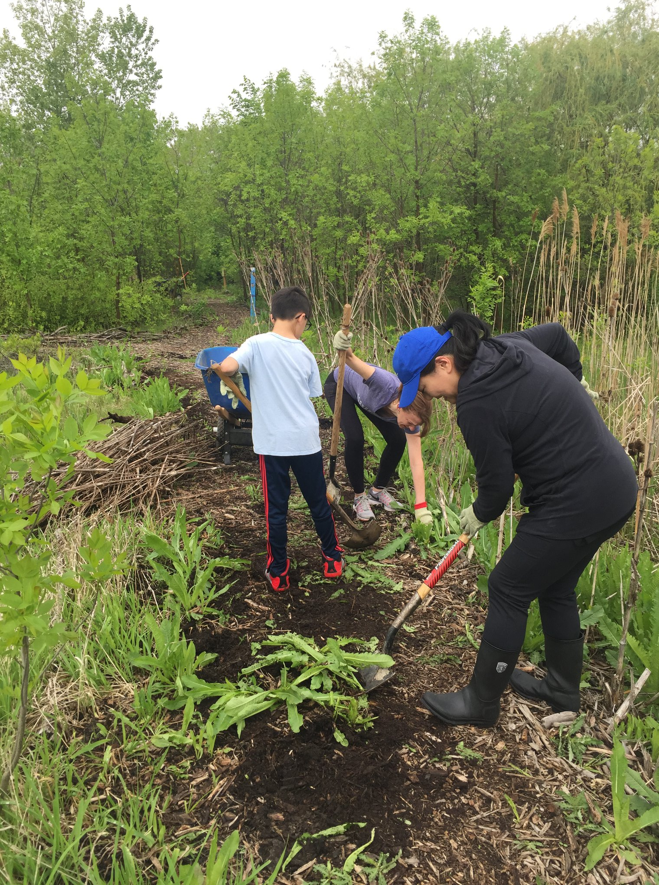
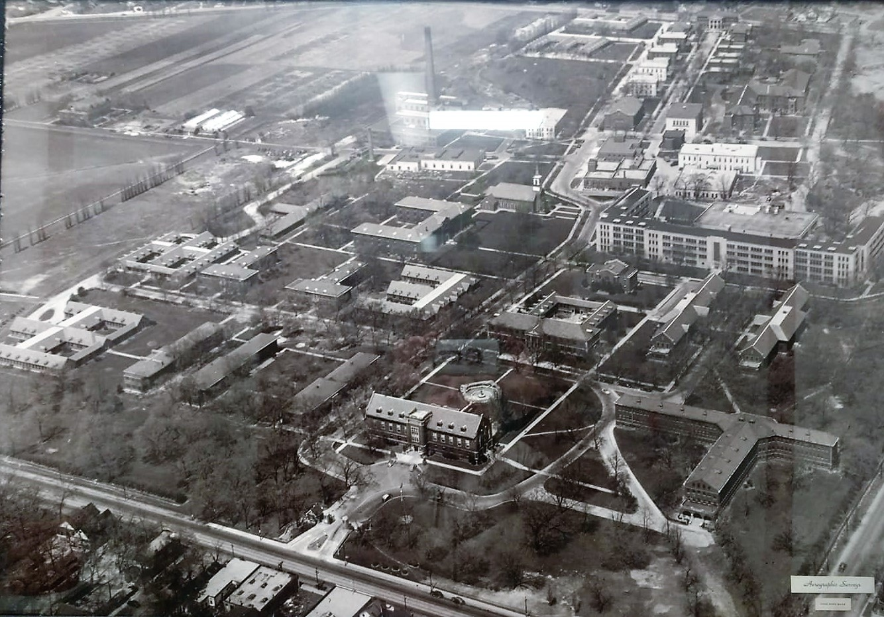
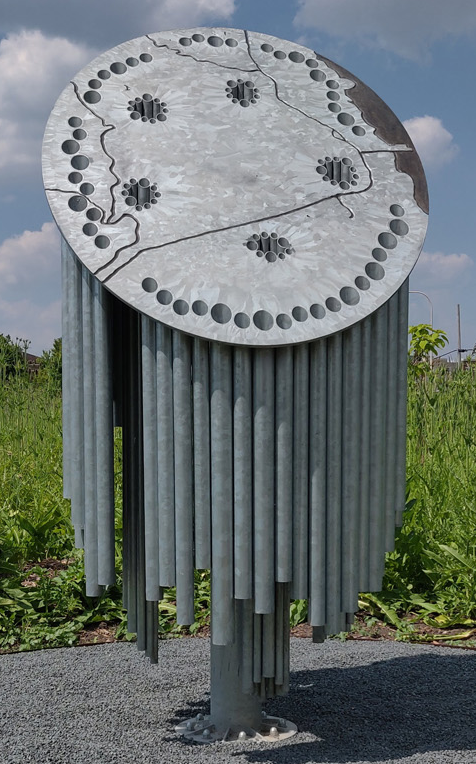

+++
title = 'About the site'
Description = 'Learn about the history of the Dunning Read Natural Area and how it became a recognised natural area'
date = 2023-01-01T08:00:00-07:00
draft = false
+++

## About Dunning Read Natural Area  ## { class="p-1 text-center text-xl sm:text-2xl lg:text-4xl" }

{class="p-5 float-none sm:float-right w-full sm:w-1/2"}

The Dunning Read Natural Area, also known as [Park 601](https://www.chicagoparkdistrict.com/parks-facilities/park-no-601-dunning-read-natural-area), is an approximately 21-acre area in the Dunning neighborhood of northwest Chicago. Comprising prairies, wetlands, and woodlands, the site has approximately 0.8 miles of trails and is under active restoration by the Chicago Park District. Currently, much of the restoration work focuses on removing invasive teasel, buckthorn, phragmites, and wild parsnip.

The site offers a unique oasis in the midst of the city, with open space and trails for public enjoyment. The woodlands and wetlands help control stormwater runoff, and provide critical habitat for native plants and animals. Hawks, coyote, red-winged blackbirds, chipmunks, killdeer, and other wildlife can be found in the natural area.

{class="p-5 float-none sm:float-left w-full sm:w-1/2"}

The area was originally inhabited by Indigenous peoples, including the Chippewa and Potawatomi. After the Black Hawk War of 1832, a man named Peter Ludby acquired the land. Just over a decade later, he sold the land to Cook County. For many years, the county used the site to operate a psychiatric hospital, which was known as the Dunning Asylum, and as a poorhouse. In 1970, the Chicago-Read Mental Health Center was built.

Today, the surrounding area is heavily developed, and the open space that remains exists because of a passionate group of community members. In 2005, a coalition of open space advocates – including local residents, and neighborhood groups such as the Austin-Irving Community Council, Northwest Concerned Citizens, and Friends of the Parks – successfully campaigned for the state to officially designate the site as a conservation area. This designation protected the woodlands and wetlands as habitat and for public use.

{class="p-5 float-none sm:float-right w-full sm:w-1/2"}

Beginning in 2007, Friends of the Parks and a dedicated group of volunteers from the local community began working to restore the area by removing invasive trees and brush, picking up litter, and planting oak trees and native prairie plants. In 2009, they created a walking trail and “council rings” or sitting circles. In 2019, a steel sculpture called “[Nesewin](https://chicagopublicartgroup.org/project/nesewin-how-to-breathe-underwater/)” was installed at the trailhead.

The Dunning Read Natural Area is the oasis it is today because of their efforts and the work of countless others, including but not limited to students and staff from Wright College, staff from the Chicago Read Mental Health Center, students from After School Matters, and members of the American Indian Center.

In 2021, a state bill backed by local lawmakers passed, and transferred the land to the Chicago Park District. The Park District now manages the site as a natural area, according to [a 2014 plan that was drafted by Friends of the Parks](https://drive.google.com/file/d/16xM3ghIc1F6rxwbKpYmB5VyJBQWvizLN/view). The Dunning Read Natural Area Park Advisory Council formed in 2022.

---

Please join us in continuing a long legacy of community involvement and advocacy for the protection and restoration of this incredible natural area.
