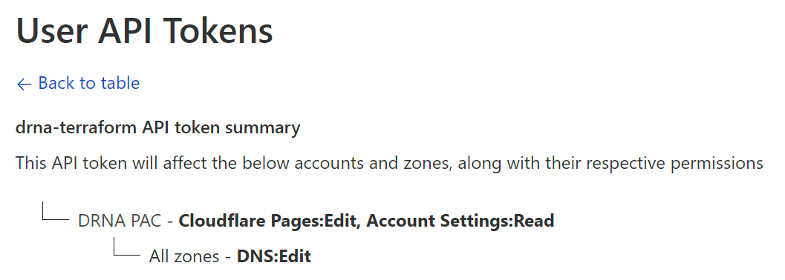

# dunningnatural.org deployment

The "source of truth" for most things is this repository, so you can likely figure most everything out from here, but this doc aims to provide a little more information on how things were initially setup & how it hangs together.

## CloudFlare

A single CloudFlare account holds:

- the `dunningnatural.org` domain name registration
- the `dunningnatural.org` DNS records
- a CloudFlare pages project that GitHub Actions deploys to
  - this pages project makes use of CloudFlare Pages Functions to enable fetching Instgram posts from the server side

Access to this account is manual, or using the `drna-terraform` user API token that is created under @mdjnewman's user.

This token, which is stored in Secret Manager in the GCP project, has fairly broad access to the account:

The token was manually and stored into Secret Manager by @mdjnewman.

## Google Cloud

GCP usage is fairly limited at the moment, really only for:

- storing the CloudFlare token described above (which could have easily been a GHA environment secret); and
- state storage for Terraform
- periodically rotating the long-lived user access token for the Instagram Basic Display API.

A note on bootstrapping - most resources in [bootstrapping.tf](https://github.com/mdjnewman/dunningnatural.org/blob/c4854e5bef67353b61565702741a218d6b35ad0e/deployment/bootstrapping.tf) were created using @mdjnewman's Owner access to the GCP project.

GitHub Actions has the ability to read these resources (mostly through the premissive `roles/viewer` role), but trying to update them will fail. This is somewhat by design, as there has to be a bootstrapping step somewhere & GitHub Actions won't be allowed access to GCP IAM.

## GitHub Actions

GitHub Actions workflows build the static site and update infrastructure (just CloudFlare, really).

If changes to the infrastructure are required, this needs to be approved by someone listed as a reviewer on the `Infra - Prod` environment.
